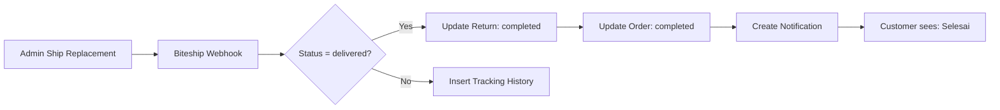

# Setup Auto-Complete Replacement via Biteship Webhook

Panduan lengkap untuk setup sistem auto-complete replacement order ketika produk pengganti sudah diterima customer.

## 🎯 Fitur

Ketika produk pengganti sudah **delivered** (terdeteksi dari Biteship webhook):
- ✅ Order status otomatis update ke `completed`
- ✅ Return status otomatis update ke `completed`
- ✅ Badge di order list berubah dari "Proses Pengembalian" → "Selesai"
- ✅ Order pindah ke tab "Selesai"
- ✅ User mendapat notifikasi "Pesanan Selesai"
- ✅ Tracking history replacement tersimpan di database

---

## 📋 Langkah Setup

### 1. Jalankan SQL di Supabase

Buka **Supabase SQL Editor** dan jalankan file ini:

```bash
create_replacement_shipping_history_table.sql
```

File ini akan membuat:
- ✅ Tabel `replacement_shipping_history`
- ✅ Indexes untuk query cepat
- ✅ RLS policies untuk keamanan

**Verifikasi:**
```sql
SELECT * FROM replacement_shipping_history LIMIT 1;
```

---

### 2. Konfigurasi Biteship Webhook

#### A. Setup di Biteship Dashboard

1. Login ke [Biteship Dashboard](https://app.biteship.com/)
2. Buka **Settings** → **Webhooks**
3. Tambah webhook URL:
   ```
   https://your-domain.com/api/biteship/webhook
   ```
4. Pilih events:
   - ✅ `order.status` (tracking update)
   - ✅ `order.waybill_id` (nomor resi)

5. Simpan **Webhook Secret** ke `.env`:
   ```bash
   BITESHIP_WEBHOOK_SECRET=your_webhook_secret_here
   ```

#### B. Test Installation

Biteship akan kirim test ping saat instalasi:
```bash
curl -X POST https://your-domain.com/api/biteship/webhook
```

Response yang diharapkan:
```json
{
  "success": true,
  "message": "ok"
}
```

---

### 3. Flow Replacement Auto-Complete



**Detail Flow:**

1. **Admin kirim replacement** via Biteship
   - Simpan `replacement_waybill` di database
   - Status return: `replacement_shipped`

2. **Biteship kirim webhook** setiap update tracking:
   ```json
   {
     "event": "order.status",
     "courier_waybill_id": "JNE123456",
     "status": "delivered"
   }
   ```

3. **Webhook handler** (auto):
   - Cek `courier_waybill_id` = `replacement_waybill`?
   - Insert tracking ke `replacement_shipping_history`
   - Jika `status = delivered`:
     - Update `returns.status` → `completed`
     - Update `orders.status` → `completed`
     - Create notification
     - Send email (optional)

4. **Frontend** (auto):
   - Badge berubah: "Proses Pengembalian" → "Selesai"
   - Order pindah ke tab "Selesai"
   - User tidak perlu action apapun

---

## 🧪 Testing dengan Postman

### Test 1: Replacement Waybill Received

```json
POST /api/biteship/webhook
Content-Type: application/json

{
  "event": "order.waybill_id",
  "order_id": "biteship_order_123",
  "courier_waybill_id": "JNE987654321",
  "courier_name": "jne",
  "courier_company": "JNE",
  "courier_type": "reg"
}
```

**Expected:**
- ✅ Insert `replacement_shipping_history`
- ✅ Status: "Nomor resi diterima"

---

### Test 2: Replacement Tracking Update

```json
POST /api/biteship/webhook
Content-Type: application/json

{
  "event": "order.status",
  "order_id": "biteship_order_123",
  "courier_waybill_id": "JNE987654321",
  "status": "picked",
  "courier_name": "jne"
}
```

**Expected:**
- ✅ Insert `replacement_shipping_history`
- ✅ Status: "Pesanan telah diserahkan ke jasa kirim"

---

### Test 3: Replacement Delivered (AUTO-COMPLETE!)

```json
POST /api/biteship/webhook
Content-Type: application/json

{
  "event": "order.status",
  "order_id": "biteship_order_123",
  "courier_waybill_id": "JNE987654321",
  "status": "delivered",
  "courier_name": "jne"
}
```

**Expected:**
- ✅ Insert `replacement_shipping_history`
- ✅ Update `returns.status` → `completed`
- ✅ Update `orders.status` → `completed`
- ✅ Create notification
- ✅ Badge berubah jadi "Selesai"

---

## 🔍 Debugging

### Check Webhook Logs

```bash
# Check console logs di server
pm2 logs

# Atau di terminal development
npm run dev
```

Look for:
```
🎉 Replacement delivered! Auto-completing order {uuid} and return {uuid}
✅ Return {uuid} status updated to 'completed'
✅ Order {uuid} status updated to 'completed'
✅ Notification created for order {uuid}
```

### Check Database

```sql
-- Check replacement tracking history
SELECT * FROM replacement_shipping_history
WHERE return_id = 'your-return-uuid'
ORDER BY created_at DESC;

-- Check return status
SELECT id, status, notes FROM returns
WHERE id = 'your-return-uuid';

-- Check order status
SELECT id, status FROM orders
WHERE id = 'your-order-uuid';

-- Check notification
SELECT * FROM notifications
WHERE order_id = 'your-order-uuid'
AND type = 'order_completed';
```

### Common Issues

**Issue 1: Webhook tidak trigger**
- ❌ Cek URL webhook di Biteship dashboard
- ❌ Cek webhook secret di `.env`
- ❌ Cek firewall/CORS settings

**Issue 2: Auto-complete tidak jalan**
- ❌ Cek `replacement_waybill` tersimpan di database
- ❌ Cek status webhook = "delivered" (bukan "Delivered")
- ❌ Cek RLS policies di `replacement_shipping_history`

**Issue 3: Badge masih "Proses Pengembalian"**
- ❌ Refresh halaman
- ❌ Cek `returns.status` = "completed"
- ❌ Cek `orders.status` = "completed"

---

## 📊 Status Mapping

| Biteship Status | Database Display | Auto Action |
|----------------|------------------|-------------|
| `confirmed` | Menunggu penjemputan | - |
| `picking_up` | Kurir menuju lokasi | - |
| `picked` | Diserahkan ke jasa kirim | - |
| `dropping_off` | Dalam Pengiriman | - |
| **`delivered`** | **Terkirim** | **✅ Auto-Complete!** |
| `cancelled` | Dibatalkan | - |
| `returned` | Dikembalikan | - |

---

## ✅ Checklist Setup

- [ ] Jalankan SQL `create_replacement_shipping_history_table.sql`
- [ ] Setup webhook URL di Biteship dashboard
- [ ] Save webhook secret ke `.env`
- [ ] Test installation webhook
- [ ] Test dengan Postman (3 scenarios)
- [ ] Verify auto-complete di browser
- [ ] Check badge berubah ke "Selesai"
- [ ] Check order pindah ke tab completed

---

## 🚀 Production Deployment

1. **Webhook URL** harus HTTPS
2. **Webhook Secret** jangan commit ke git
3. **Error handling** sudah ada di webhook handler
4. **Logging** aktif untuk debugging
5. **RLS policies** protect user data

---

## 📝 Notes

- Webhook berjalan **real-time** dari Biteship
- Tidak perlu cron job
- User tidak perlu buka halaman
- Auto-complete instant ketika delivered
- Support semua kurir (J&T, SiCepat, JNE, dll)

---

**Status:** ✅ Ready for Production
**Last Updated:** 2025-01-13
